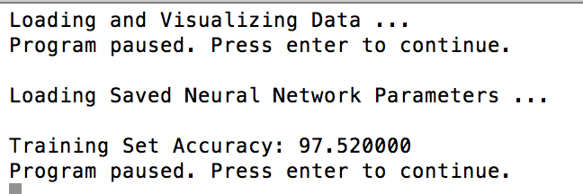
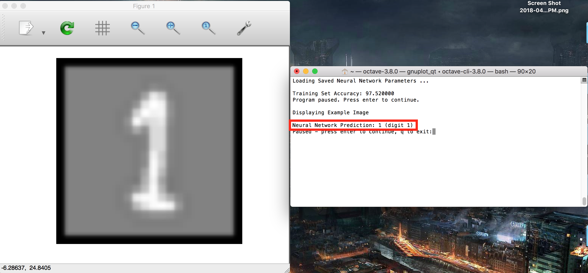
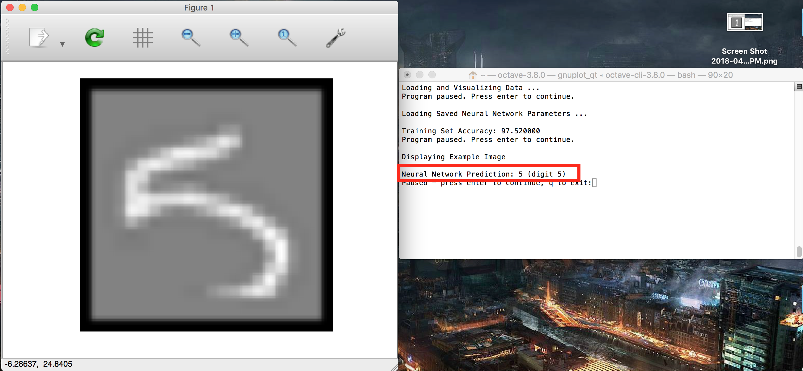
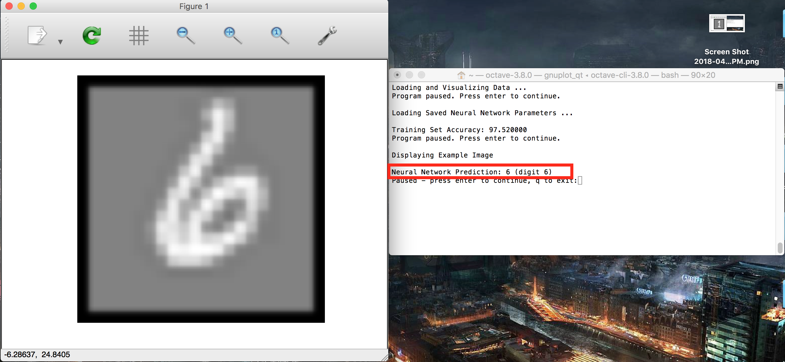

# feedforward_recognize_handwriting
A simple implementation of recognition handwriting  

This repo is actually the assignment in week4 of the machine learning on the coursera which taught by Andrew.Ng. The idea is quite simple -- using neural network(more specifically, feedforward algorithm).

The accuracy of neural network could be up to 97%, which is much better than logistical regression. And running time seems quick a lot compared with another one.

Here are some test examples:

All codes are implemented via octave language.
